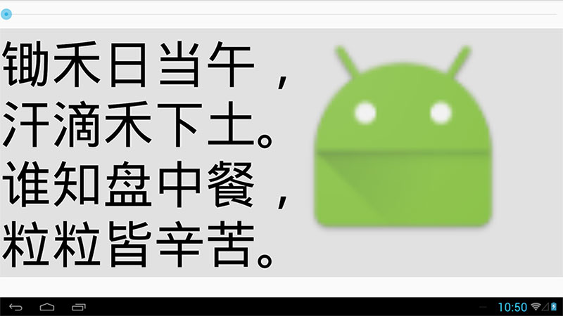
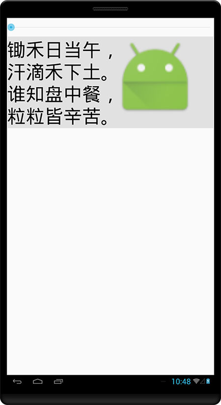
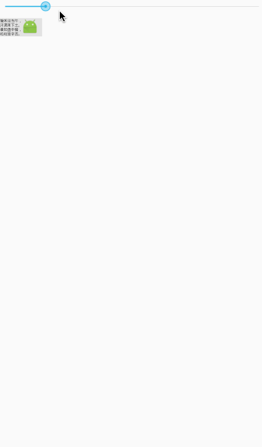

## SupperLayout


### 一、XML属性一揽
#### 1.SupperLayout属性
```XML
 <com.sumauto.SupperLayout
    app:support_edit_mode="true|false"
    app:layout_height_units="integer|auto"
    app:layout_width_units="1920"
    app:fixedBy="width|height"/>
```
>`app:support_edit_mode="true|false"`
>
>在编写xml时,预览窗口是否展示布局相关的参数，运行时无效

>`app:layout_width_units="integer|auto"`
>
>SupperLayout宽度的数值,如果为auto则自动计算一个宽度数值

>`app:layout_height_units="integer|auto"`
>
>SupperLayout高度的数值,如果为auto则自动计算一个高度数值

>`app:fixedBy="width|height"`
>
>width固定宽度，height固定高度。默认值是width

####  2.子标签属性
```XML
 <ImageView
    android:src="#d91"
    app:heightUnits="160"
    app:widthUnits="160"
    app:x="50"
    app:y="50"/>

 <TextView
     app:x="240"
     app:y="100"
     android:layout_width="match_parent"
     android:text="SupperLayout"
     android:textColor="#000"
     app:textSizeUnits="40"/>
````

>`app:heightUnits="integer"`
>
>控件高度的数值

>`app:widthUnits="integer"`
>
>控件宽度的数值

>`app:x="integer"`
>
>控件的x坐标，默认是0

>`app:y="integer"`
>
>控件的y坐标，默认是0

>`app:textSizeUnits="40"`
>
>文字的大小

## 二、Demo

### 1.用SeekBar测试自适应
>布局文件


```xml
<?xml version="1.0" encoding="utf-8"?>
<LinearLayout
    xmlns:android="http://schemas.android.com/apk/res/android"
    xmlns:app="http://schemas.android.com/apk/res-auto"
    android:layout_width="match_parent" android:layout_height="match_parent"
    android:orientation="vertical">
    <SeekBar
        android:id="@+id/mSeeker"
        android:layout_marginTop="20dp"
        android:layout_marginBottom="20dp"
        android:layout_width="match_parent"
        android:layout_height="wrap_content"
        android:layout_gravity="bottom"
        android:max="100"/>
    <com.sumauto.SupperLayout
        android:id="@+id/mSupperLayout"
        android:layout_width="match_parent"
        android:layout_height="wrap_content"
        android:background="#1a000000"
        app:layout_width_units="768">

        <TextView android:text="@string/chuhe"
                  android:textColor="#000"
                  app:textSizeUnits="70"/>
        <ImageView android:src="@mipmap/ic_launcher"
                   app:heightUnits="300"
                   app:widthUnits="300"
                   app:x="400"/>
    </com.sumauto.SupperLayout>

</LinearLayout>
```

>横屏和竖屏的截图

 * 横屏
 

 * 竖屏
 

 * 动态调整
 


>无论是横屏还是竖屏，SupperLayout总是把宽度划分为768个单位，ImageView的大小是300等分，
文字的大小是70等分。可以看出，无论屏幕的宽度怎么变化，ImageView和TextView的相对大小和相
对位置，都没有发生变化从而实现自适应布局

```xml
<?xml version="1.0" encoding="utf-8"?>
 <!--suppress AndroidDomInspection -->
 <com.sumauto.SupperLayout
     xmlns:android="http://schemas.android.com/apk/res/android"
     xmlns:app="http://schemas.android.com/apk/res-auto"
     android:layout_width="match_parent"
     android:layout_height="match_parent"
     android:background="#fff"
     app:support_edit_mode="true"
     android:orientation="vertical"
     app:layout_height_units="1080"
     app:layout_width_units="1920">

     <ImageView
         android:src="#d91"
         app:heightUnits="160"
         app:widthUnits="160"
         app:x="50"
         app:y="50"
     />

     <TextView
         app:x="240"
         app:y="100"
         android:layout_width="match_parent"
         android:layout_height="wrap_content"
         android:text="SupperLayout"
         android:textColor="#000"
         app:textSizeUnits="40"/>

 </com.sumauto.SupperLayout>
```
